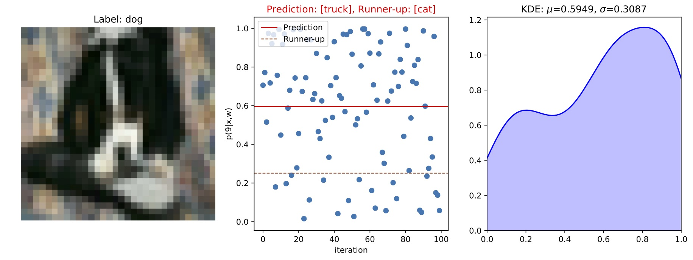
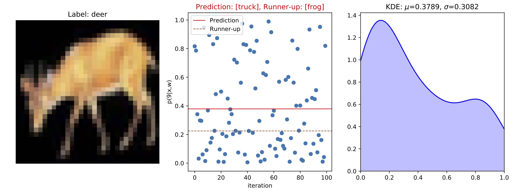
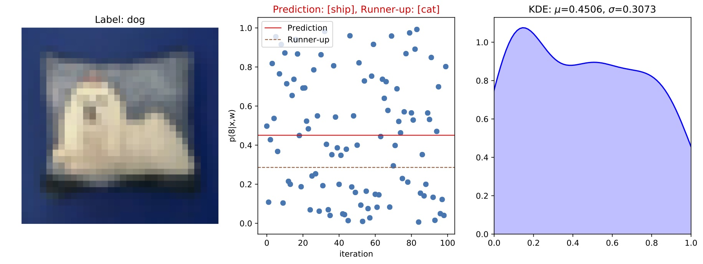
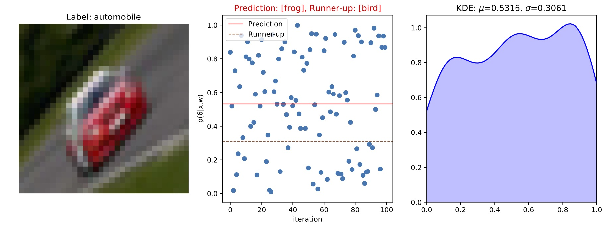
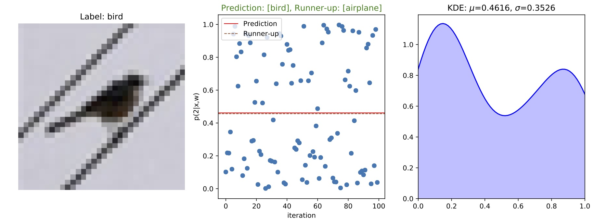
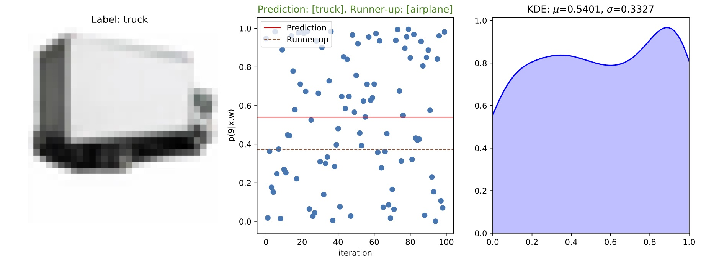
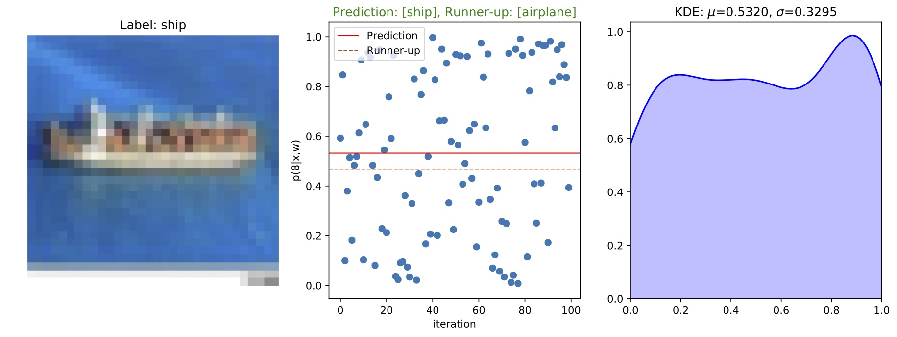
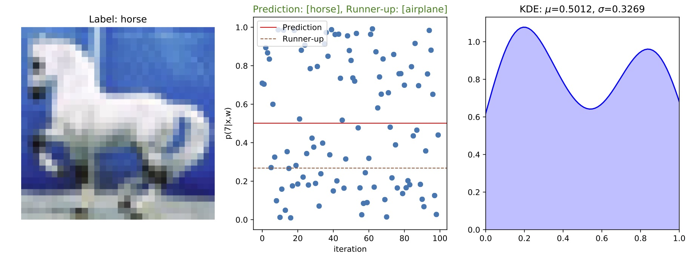
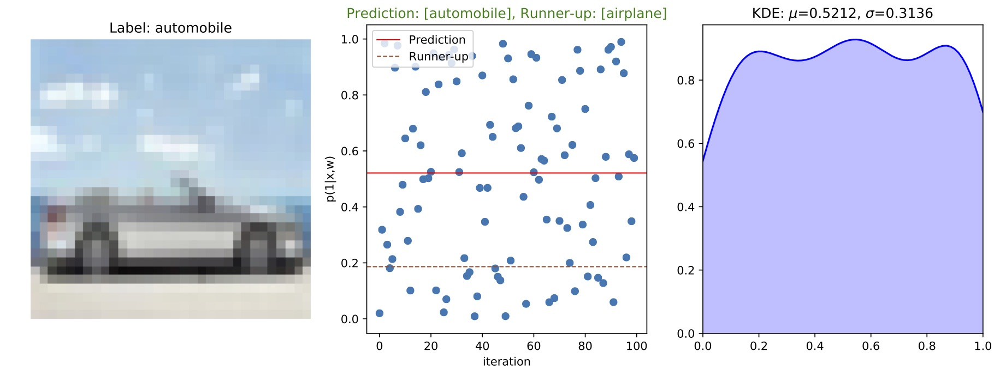

***
# Setup
In this notebook we use the following R packages: `tidyverse` and `ggplot2`. In addition we use the `multiplot` functionality provided by [Cookbook for R](http://www.cookbook-r.com/Graphs/Multiple_graphs_on_one_page_(ggplot2)/). In Python we use `fastai`, `numpy` and `pandas`. Full code for training and inference [available at GitHub](link). All code for statistical analysis is included in this document.

```{r echo=FALSE, results='hide'}
# Loading useful packages
library(tidyverse)
library(ggplot2)
library(Hmisc)
library(knitr)
#library(kableExtra)

# Multiple plot function
#
# ggplot objects can be passed in ..., or to plotlist (as a list of ggplot objects)
# - cols:   Number of columns in layout
# - layout: A matrix specifying the layout. If present, 'cols' is ignored.
#
# If the layout is something like matrix(c(1,2,3,3), nrow=2, byrow=TRUE),
# then plot 1 will go in the upper left, 2 will go in the upper right, and
# 3 will go all the way across the bottom.
#
multiplot <- function(..., plotlist=NULL, file, cols=1, layout=NULL) {
  library(grid)

  # Make a list from the ... arguments and plotlist
  plots <- c(list(...), plotlist)

  numPlots = length(plots)

  # If layout is NULL, then use 'cols' to determine layout
  if (is.null(layout)) {
    # Make the panel
    # ncol: Number of columns of plots
    # nrow: Number of rows needed, calculated from # of cols
    layout <- matrix(seq(1, cols * ceiling(numPlots/cols)),
                    ncol = cols, nrow = ceiling(numPlots/cols))
  }

 if (numPlots==1) {
    print(plots[[1]])

  } else {
    # Set up the page
    grid.newpage()
    pushViewport(viewport(layout = grid.layout(nrow(layout), ncol(layout))))

    # Make each plot, in the correct location
    for (i in 1:numPlots) {
      # Get the i,j matrix positions of the regions that contain this subplot
      matchidx <- as.data.frame(which(layout == i, arr.ind = TRUE))

      print(plots[[i]], vp = viewport(layout.pos.row = matchidx$row,
                                      layout.pos.col = matchidx$col))
    }
  }
}

# Data cleaning function
process <- function(ROOT, filename, name, kernel_sz, drop_rate){
  ROOT <- "~/Documents/Masteroppgave/Data/Resultater/"
  PATH <- paste(ROOT, filename, sep="")
  dat <- as.tibble(read.csv(as.character(PATH)))
  #dat <- select(dat, -X)
  dat <- dat %>% 
    mutate(model=name,
           kernel=kernel_sz,
           dropout=drop_rate)
  return(dat)
}
```
# Introduction

The success of deep learning models has typically been measured in terms of their predictive power, but they have lacked a principled way of expressing uncertainty about these predictions.

In my master's thesis we apply recent insights connecting dropout neural networks to [Bayesian approximate variational inference (VI)](https://arxiv.org/abs/1601.00670). VI is technique for approximating intractable integrals that arise when modelling the posterior distribution in Bayesian inference and machine learning. Gal et. al. [1, 2, 3] have shown that the posterior distribution of a NN can be approximated by leaving dropout on at test time and sampling multiple predictions. This amounts to drawing Monte Carlo (MC) samples from the posterior (a brief description of this process is listed in section 1.1). The Bayesian framework allows us to obtain principled uncertainty estimates when making predictions in these so called *MC dropout* NNs. 

The results of [1,2,3] seem particularly promising when applied to healthcare. In fact, a recent paper published in Nature [4] applies MC dropout to capture uncertainty estimates when predicting the presence of diabetic retinopathy in patients. This paper demonstrates how uncertainty estimates can provide useful information to the clinician tasked with interpreting the results of medical images. The key idea is that this human-machine interaction will lead to overall better results than either could produce individually.

In this notebook I will first briefly introduce the general idea behind MC dropout. Then we will apply MC dropout in a classification task based on the collection of labelled images in the [CIFAR-10 data set](https://www.cs.toronto.edu/~kriz/cifar.html).

## Background

A neural network is made up of many neurons which are organized in layers. Neurons are often called nodes or units, depending on your choice of machine learning literature. Henceforth we will refer to them as units. 

In a typical neural network there are many, many units. As a consequence the number of parameters greatly exceeds the number of data points, dramatically increasing the risk of overfitting (i.e. there are many settings of weights which will cause the network to fit the data almost perfectly).

Dropout is a common stochastic regularisation technique [5] that is used to prevent overfitting in neural networks. The term dropout refers to randomly "dropping out" nonoutput units, temporarily removing all connections to the rest of the network. The main idea is that if the presence of other units is unreliable, each unit is forced to learn how to be useful on its own. At test time all units are activated, and the weights of the network are scaled by the dropout rate in order to match the expected output during training.

Recent work by Gal et. al. [1, 2, 3] casts dropout neural networks as approximate Bayesian inference. Their results show that the predictive posterior distribution of a neural network can be approximated by leaving dropout on at test time. 

Consider a classification setting, such as in CIFAR-10. Essentially, what happens when applying MC dropout is the following:

* An image is fed forward through the network $T$ times (we use $T=100$ as recommended in [4]). Each time the image is fed through is called a *stochastic forward pass*.
* For each stochastic forward pass, a slightly different network is making predictions because dropout has randomly switched off units. 
* As a result each stochastic forward pass returns 100 slightly different vectors of class predictions.
* To make a prediction we average the 100 vectors. The class corresponding to the largest element in the resulting vector is our final prediction.
* Finally we calculate the standard deviation in class predictions over all forward passes. This is our estimated uncertainty.

Mathematically, model uncertainy is approximated the empirical standard deviation of the predictions for class $k$, i.e. $$\hat{\sigma}_k = \sqrt{\frac{\sum_{t=1}^T{[p_t(k|X,w) - \hat{\mu}_k}]^2}{T-1}}$$ where $$\hat{\mu}_k = \frac{1}{T}\sum_{t=1}^T p_t(k|X,w)$$ is the averaged softmax outputs of the predicted class.

Gal et. al. [3] show that the above amounts to drawing Monte Carlo samples from the predictive posterior. Their work demonstrates that applying dropout is effectively the same as defining a *Bayesian neural network* with a Bernoulli approximating prior over the parameters. [Gal has written an excellent blog post that introduces the work](http://mlg.eng.cam.ac.uk/yarin/blog_3d801aa532c1ce.html) and the derivation.

## Problem statement

The derivation in Gal et. al. [2] is based on the observation that a shallow neural network with infinitely many weights converges to a Gaussian process (GP) with a specific covariance function. A GP is a non-parametric, probabilistic machine learning method. The idea is that we place a prior distribution over the function space, and by observing new data points we can figure out which function is most likely to have generated the observed data. A GP is fully specified by its mean and covariance functions, and allows us to obtain uncertainty estimates [1]. The extension of this to dropout neural networks is the main result of Gal et. al. [2].

In [1] however, Gal et. al. extend this idea further to include priors over the weights of the convolutional layers in a convolutional neural network (CNN). A CNN is a specialized type of neural network, used primarily and very effectively for image analysis. The authors briefly state that the GP interpretation is lost when the model is extended to CNNs, but that these networks still can be "modelled as Bayesian".

As far as we are aware, there have been no efforts to determine the correlation between the approximated uncertainty and a network's ability to predict correctly. Moreover, the work done so far seems to focus on the uncertainty associated with the predicted class. We will examine if there is any additional information to be gained from establishing a connection between the prediction and the *runner-up* prediction. In other words, our problem statement is:

> *Are the uncertainty approximations obtained by applying Monte Carlo dropout to convolutional neural networks a reasonable measure of model uncertainty?*

## Experimental setup{.tabset}

State-of-the-art architectures such as ResNet and DenseNet are very powerful, but they are also complicated and their inner workings are quite convoluted. We are primarily interested in examining the correlation between uncertainty estimation and predictive capabilities. It is arguably better to use a simple network architecture to illustrate the idea of MC dropout. In our approach we use LeNet-5. Click on the tabs for implementation details. Full code is available on [GitHub](link).

### Model

LeNet-5 was a pioneering 7-layer convolutional neural network originally developed by Yann LeCunn in 1998 for handwritten digit recognition. It is hopelessly primitive compared to contemporary architectures, but still captures the gist of what a convolutional network is while remaining simple enough to allow us to understand every building block of the network. The following chunk shows the model architecture:

```{python python.reticulate=FALSE, eval=FALSE}
class lenet_all(nn.Module):
    def __init__(self, conv_size=conv_size, pool_size=2, drop_rate=p):
        super().__init__()
        self.drop_rate = drop_rate
        self.conv1 = nn.Conv2d(in_channels=3, out_channels=192, kernel_size=conv_size)
        self.dropmc1 = DropoutMC(p)
        self.pool1 = nn.MaxPool2d(kernel_size=pool_size, stride=2)
        self.conv2 = nn.Conv2d(in_channels=192, out_channels=192, kernel_size=conv_size, padding=2)
        self.dropmc2 = DropoutMC(p)
        self.pool2 = nn.MaxPool2d(kernel_size=pool_size, stride=2)
        self.dense1 = nn.Linear(in_features=7*7*192, out_features=1000)
        self.dropmc3 = DropoutMC(p)
        self.dense2 = nn.Linear(in_features=1000, out_features=10)
        
    def forward(self, x):
        x = self.dropmc1(self.conv1(x))
        x = self.pool1(x)
        x = self.dropmc2(self.conv2(x))
        x = self.pool2(x)
        x = x.view(x.size(0), -1)
        x = self.dropmc3(F.relu(self.dense1(x)))       
        x = self.dense2(x)
        
        return x
```
<br>

### MC dropout layer

Our specification of LeNet-5 differs from the orginial in one crucial way: We use Monte Carlo dropout layers. MC dropout is not a feature that is implemented in PyTorch, and we must therefore implemenet one ourselves. Fortunately, this amounts to a simple adjustment of existing code. We modify the `Dropout` class to take an additional argument called `dropoutMC` with default value set to `True`:

```{python python.reticulate=FALSE, eval=FALSE}
class DropoutMC(nn.Module):
    r"""
    Modified version of Dropout from torch/nn/modules/dropout.py
    Args:
        p: probability of an element to be zeroed. Default: 0.5
        dropoutMC: If set to ``True``, dropout is turned on at test time. Default: ``True`
        inplace: If set to ``True``, will do this operation in-place. Default: ``False``
    Shape:
        - Input: `Any`. Input can be of any shape
        - Output: `Same`. Output is of the same shape as input
    Examples::
        >>> m = nn.Dropout(p=0.2)
        >>> input = autograd.Variable(torch.randn(20, 16))
        >>> output = m(input)
    .. _Improving neural networks by preventing co-adaptation of feature
        detectors: https://arxiv.org/abs/1207.0580
    """

    def __init__(self, p=0.5, dropoutMC=True, inplace=False):
        super(DropoutMC, self).__init__()
        if p < 0 or p > 1:
            raise ValueError("dropout probability has to be between 0 and 1, "
                             "but got {}".format(p))
        self.p = p
        self.dropoutMC = dropoutMC
        self.inplace = inplace

    def forward(self, input):
        return F.dropout(input, self.p, self.dropoutMC, self.inplace)

    def __repr__(self):
        inplace_str = ', inplace' if self.inplace else ''
        return self.__class__.__name__ + '(' \
            + 'p=' + str(self.p) \
            + inplace_str + ')'
```
<br>

### Inference

We need to define a function that performs inference over out input. The following chunk contains the relevant code for the sampling procedure described in section 1.1. The function `inference` stores all the relevant statistics and softmax distributions in a dictionary named `output`. The results are then turned into a pandas dataframe and some very basic feature engineering is performed. Finally, the data is prepared for statistical analysis in R.

```{python python.reticulate=FALSE, eval=FALSE}
def inference(learner, data, T=100):
    ''' Function that gathers all relevant numerical results from MC dropout over T iterations.
        
        Arguments:
        learner, fastai learner object
        data, fastai dataloader
        T, number of stochastic forward passes
    '''
    # Get images, labels and filenames
    imgs, labels = next(iter(data.val_dl))
    fnames = data.val_ds.fnames

    # Empty dictionary to store all output
    output = {}

    # Empty array to store results in
    results = np.empty((T, num_classes))

    # iterator index to keep in dictionary
    k=0

    for (img, label, fname) in list(zip(imgs, labels, fnames)):

        for i in range(T):
            prediction = learner.predict_array(img[None])
            results[i] = prediction

        probs = to_np(F.softmax(V(results)))
        probs_mean = np.mean(probs, axis=0)
        pred_std = np.std(probs, axis=0)

        prediction = probs_mean.argmax()
        uncertainty = pred_std[prediction]

        correct = 1 if prediction == label else 0

        output[k] = {"img": fname, "softmax_dist": probs, "probs": probs_mean, "prediction": prediction, "truth": label, "uncertainty": uncertainty, "correct": correct}
        k+=1
    
    return output
```

## Models

We will examine data gathered from four variants of LeNet-5. All models were trained on CIFAR-10 using the `fastai` API. CIFAR-10 contains 60.000 labelled 32x32x3 color images belonging to 10 different classes. The input data was split into a training set of 50.000 images and a test set of 10.000 images. The training set was further split into a training set and a validation set. All models have `weight_decay = 0.0005` and all learning rates were chosen using `lr_find`:

* `model55`: Trained for 60 epochs with a learning rate of 0.001 and `kernel size = (5,5)` and `drop_rate = .5`.  **0.71280 validation loss** at end of training with an **accuracy of 0.76137** on the validation data. `model55` represents the baseline implementation of LeNet-5. It is identical in structure to the one used by Gal et. al. [1].

* `model52`: Trained for 14 epochs with a learning rate of 0.01 for the first 7 and 0.0001 on the remaining. Changed due to rapid overfitting. Model has `kernel size = (5,5)` and `drop_rate = .2`. **0.74186 validation loss** at end of training with an **accuracy of 0.74406** on the validation data.

* `model35`: Trained for 66 epochs with a learning rate of 0.001 and `kernel size = (3,3)` and `drop_rate = .5`. **0.75483 validation loss** at end of training with an **accuracy of 0.74218** on the validation data. 

* `model32`: Trained for 52 epochs with a learning rate of 0.001 and `kernel size = (3,3)` and `drop_rate = .2`. **0.75449 validation loss** at end of training with an **accuracy of 0.74090** on the validation data.

Note that `model55` has a slightly better baseline performance than the other models.


## Data

The data contains the following variables after it has been prepared for analysis in R:

* `correct` (logical): indicator the is `TRUE` if the predicted class label matches the true class label, else `FALSE`.

* `prediction` (int): predicted class label.

* `truth` (int): true class label.

* `uncertainty` (dbl): empirical standard deviation of softmax values for predicted class.

* `prob1` (dbl): argmax of mean softmax output, i.e. mean probability of predicted class.

* `prob2` (dbl): mean probability of runner-up prediction.

* `class2` (int): class label of runner-up prediction.

* `logit_prob1` (dbl): logit transformation of `prob1`.

* `diff` (dbl): `prob1`-`prob2`

* `diff_sd_ratio` (dbl): `diff/uncertainty`.

All the variables above are pretty standard, with the exception of `diff_sd_ratio`. Intuitively, if `diff` is large, the averaged models all agree that class $k$ is the correct prediction. If `diff` is small, the models sampled by MC dropout don't agree on a single class. Thus `diff` also serves as a proxy for uncertainty. Model `uncertainty`, however, is approximated by the empirical standard deviation of the predictions for class $k$. Thus `diff_sd_ratio` is expressed by $$\tau_{kj} = \frac{\hat{\mu}_k - \hat{\mu}_j}{\hat{\sigma}_k}$$ where $j$ is the runner-up prediction. $\tau_{jk}$ gives us a ratio of two different measures of uncertainty.

# Exploratory analysis

This section will be divided into to parts. First, we will examine the resulting data from `model55`, which will be regarded as our baseline model. Next, we will analyse the data from models obtained by varying kernel sizes and dropout rates.  

## Uncertainty analysis of baseline model {.tabset}

### Entire data set

```{r}
# Importing data
data <- as.tibble(read.csv("~/Documents/Masteroppgave/Data/Resultater/lenet-model55.csv"))
df <- select(data, -X)

# Summarizing entire data set
summary(df)
```
For the entire set of classifications, we have the following notable quantities:

* The mean **uncertainty** of the predicted class is `r mean(df$uncertainty)` and the median is `r median(df$uncertainty)`. The minimum value is `r min(df$uncertainty)`, the maximum is `r max(df$uncertainty)`. The interquartile range (IQR) is `r IQR(df$uncertainty)`.

* The mean **softmax output of the predicted class** is `r mean(df$prob1)` and the median is `r median(df$prob1)`. The minimum value is `r min(df$prob1)`, the maximum is `r max(df$prob1)`. The IQR is `r IQR(df$prob1)`.

* The mean **softmax output of the runner-up** is `r mean(df$prob2)` and the median is `r median(df$prob2)`. The minimum value is `r min(df$prob2)`, the maximum is `r max(df$prob2)`. The IQR is `r IQR(df$prob2)`.

* The mean **difference** between the softmax ouputs of the prediction and runner-up is `r mean(df$diff)` and the median is `r median(df$diff)`. The minimum value is `r min(df$diff)`, the maximum is `r max(df$diff)`. The IQR is `r IQR(df$diff)`.

* The mean **difference to uncertainty ratio**, or $\tau_{jk}$, is `r mean(df$diff_sd_ratio)` and the median is `r median(df$diff_sd_ratio)`. The minimum value is `r min(df$diff_sd_ratio)`, the maximum is `r max(df$diff_sd_ratio)`. The IQR is `r IQR(df$diff_sd_ratio)`.

### Summary statistics
```{r}
# Aggregating summary statistics by correct/incorrect
agg_df <- df %>% 
  group_by(correct) %>% 
  summarise(n=n(),
            mean_prob1=mean(prob1),
            mean_prob2=mean(prob2),
          mean_uncertainty=mean(uncertainty),
          median_uncertainty=median(uncertainty),
          sd_uncertainty=sd(uncertainty), 
          mean_diff=mean(diff),
          median_diff=median(diff),
          sd_diff=sd(diff),
          mean_ratio=mean(diff_sd_ratio),
          median_ratio=median(diff_sd_ratio),
          sd_ratio=sd(diff_sd_ratio))
agg_df
```
* The model has **incorrectly classified** `r agg_df$n[1]` images.

* The model has **correctly classified** `r agg_df$n[2]` images.

### Incorrect classifications
```{r}
# Summarizing incorrect predictions
incorrect_df <- df %>% 
  filter(correct==0)
summary(incorrect_df)
```
For the entire set of **incorrect classifications**, we have the following notable quantities:

* The mean **uncertainty** of the predicted class is `r mean(incorrect_df$uncertainty)` and the median is `r median(incorrect_df$uncertainty)`. The minimum value is `r min(incorrect_df$uncertainty)`, the maximum is `r max(incorrect_df$uncertainty)`. The interquartile range (IQR) is `r IQR(incorrect_df$uncertainty)`.

* The mean **softmax output of the predicted class** is `r mean(incorrect_df$prob1)` and the median is `r median(incorrect_df$prob1)`. The minimum value is `r min(incorrect_df$prob1)`, the maximum is `r max(incorrect_df$prob1)`. The IQR is `r IQR(incorrect_df$prob1)`.

* The mean **softmax output of the runner-up** is `r mean(incorrect_df$prob2)` and the median is `r median(incorrect_df$prob2)`. The minimum value is `r min(incorrect_df$prob2)`, the maximum is `r max(incorrect_df$prob2)`. The IQR is `r IQR(incorrect_df$prob2)`.

* The mean **difference** between the softmax ouputs of the prediction and runner-up is `r mean(incorrect_df$diff)` and the median is `r median(incorrect_df$diff)`. The minimum value is `r min(incorrect_df$diff)`, the maximum is `r max(incorrect_df$diff)`. The IQR is `r IQR(incorrect_df$diff)`.

* The mean **difference to uncertainty ratio**, or $\tau_{jk}$, is `r mean(incorrect_df$diff_sd_ratio)` and the median is `r median(incorrect_df$diff_sd_ratio)`. The minimum value is `r min(incorrect_df$diff_sd_ratio)`, the maximum is `r max(incorrect_df$diff_sd_ratio)`. The IQR is `r IQR(incorrect_df$diff_sd_ratio)`.

### Correct classifications

```{r }
# Summarizing correct predictions
correct_df <- df %>% 
  filter(correct==1)
summary(correct_df)
```
For the entire set of **correct classifications**, we have the following notable quantities:

* The mean **uncertainty** of the predicted class is `r mean(correct_df$uncertainty)` and the median is `r median(correct_df$uncertainty)`. The minimum value is `r min(correct_df$uncertainty)`, the maximum is `r max(correct_df$uncertainty)`. The interquartile range (IQR) is `r IQR(correct_df$uncertainty)`.

* The mean **softmax output of the predicted class** is `r mean(correct_df$prob1)` and the median is `r median(correct_df$prob1)`. The minimum value is `r min(correct_df$prob1)`, the maximum is `r max(correct_df$prob1)`. The IQR is `r IQR(correct_df$prob1)`.

* The mean **softmax output of the runner-up** is `r mean(correct_df$prob2)` and the median is `r median(correct_df$prob2)`. The minimum value is `r min(correct_df$prob2)`, the maximum is `r max(correct_df$prob2)`. The IQR is `r IQR(correct_df$prob2)`.

* The mean **difference** between the softmax ouputs of the prediction and runner-up is `r mean(correct_df$diff)` and the median is `r median(correct_df$diff)`. The minimum value is `r min(correct_df$diff)`, the maximum is `r max(correct_df$diff)`. The IQR is `r IQR(correct_df$diff)`.

* The mean **difference to uncertainty ratio**, or $\tau_{jk}$, is `r mean(correct_df$diff_sd_ratio)` and the median is `r median(correct_df$diff_sd_ratio)`. The minimum value is `r min(correct_df$diff_sd_ratio)`, the maximum is `r max(correct_df$diff_sd_ratio)`. The IQR is `r IQR(correct_df$diff_sd_ratio)`.

## Distribution of uncertainty {.tabset}

In the following we will visualize the relationships between our variabels. We start by examining the empirical distribution of the uncertainty estimates $\hat{\sigma}_k$.

### Full distribution

The distribution appears to be bimodal, with peaks close to 0 and 0.2:

```{r fig.height=4, fig.width=6}
# Distribution of estimated uncertainty
p1 <- df %>% 
  ggplot(aes(x=uncertainty)) +
  geom_histogram(col="grey", bins = 50, alpha=.5) +
  ggtitle("Distribution of estimated uncertainty")
p1
```

### Uncertainty by prediction

By grouping the uncertainty estimates by `correct` (i.e. if the label was correctly predicted or not), we can find out how the predictions contribute to the uncertainty distribution.

The blue line corresponds to the correct predictions, the red line corresponds to incorrect predictions. We see that the incorrect predictions are centered around a higher associated uncertainty, whereas far more of the correctly predicted classes are concentrated around a low uncertainty value. The incorrect classifications greatly contribute to the bimodality, but it is also present in the distribution of uncertainty for the correct classifications. 

```{r}
#Distribution of estimated uncertainty by prediction
p2 <- df %>% 
  ggplot(aes(x=uncertainty, col=factor(correct))) +
  geom_freqpoly(alpha=.7) +
  ggtitle("Distribution of estimated uncertainty by classification") +
  scale_color_discrete(name="Prediction",
                         breaks=c("0", "1"),
                         labels=c("0: Incorrect", "1: Correct"))
p2
```

### Kernel density estimates

The following kernel density estimate plot (using a Gaussian kernel) gives us an idea of how the distributions compare to eachother:

```{r}
# KDE by correct prediction
p3 <- df %>% 
  ggplot(aes(x=uncertainty)) +
  geom_density(data=incorrect_df, fill="red", alpha=I(.2)) +
  geom_density(data=correct_df, fill="turquoise", alpha=I(.2)) +
  ggtitle("Kernel density estimates of uncertainty distribution")
p3
```

### Boxplots

The boxplot gives us yet another way to visualize the difference between uncertainty distributions by predictive ability. It is interesting to note the amount of outliers for the incorrect predictions, indicating som negative skew. It is wrong, but uncertainty is low.

```{r}
# Boxplot of uncertainties for correct vs. incorrect
p4 <- df %>% 
  ggplot(aes(x=factor(correct), y=uncertainty)) +
  geom_boxplot(aes(fill=factor(correct)), alpha=.7) +
  labs(x="correct") +
  ggtitle("Boxplot of uncertainty distribution by correct/incorrect") +
  scale_fill_discrete(name="Prediction",
                         breaks=c("0", "1"),
                         labels=c("0: Incorrect", "1: Correct"))
p4
```

## Relationship to other variables {.tabset}

### Softmax of predicted class

We may also be interested in the relationship between `uncertainty` and other variables. First, we plot `uncertainty` against `prob1` (the prediction's softmax output). The softmax outputs in the above plot are colour graded. Outputs close to 1 are red, outputs close to 0 are blue. The plot shows a clear parabolic shape:

```{r}
# Plotting softmax output of prediction against estimated uncertainty
p5 <- df %>% 
  ggplot(aes(x=prob1, y=uncertainty)) +
  geom_point(alpha=.2) +
  ggtitle("Uncertainty vs. softmax output of prediction for all observations") +
  labs(x="softmax output of predicted class") +
  scale_color_distiller(name="Softmax output",
                        palette = "Spectral")
p5
```

### By classification

```{r}
p6 <- df %>% 
  mutate(correct=as.logical(correct)) %>% 
  ggplot(aes(x=prob1, y=uncertainty)) +
  geom_point(aes(fill=correct, col=correct), shape=21, alpha=.5) +
  ggtitle("Uncertainty vs. softmax output of prediction for all observations") +
  labs(x="softmax output of predicted class")
p6
```


### Predictions and runners-up

We can obtain more information by colouring the points by the value of the runner-up predictions. This plot is particularly interesting. The softmax outputs of the runner-up classes $\hat{\mu}_j$ in the above plot are colour graded. $\hat{\mu}_j \approx 0.5$ are red, $\hat{\mu}_j \approx 0$ are blue. The round point is the pair mean values of (`prob1`, `prob2`) for the incorrect predictions. The triangular point is the pair mean values for the correct predictions.

We see a clear concentration of red points in the area where the probability of the predictied class $\hat{\mu}_k \approx 0.5$. If the softmax predictions of both the predicted class and the runner-up are close 0.5, then we have a situation analogous to maximum entropy. This points coincide with the largest approximated uncertainty values. 

```{r}
# Plotting softmax output of prediction against estimated uncertainty, coloured by softmax output of runner-up
p7 <- df %>% 
  ggplot(aes(x=prob1, y=uncertainty)) +
  geom_point(aes(col=prob2), shape=21, alpha=.7) +
  geom_point(data=agg_df, aes(x=mean_prob1, y=mean_prob2, shape=as.logical(correct)), size=2.5) +
  #geom_point(data=agg_df, aes(y=uncertainty, x=mean_prob1, shape=as.logical(correct)), size=2) +
  ggtitle("Uncertainty vs. softmax output of prediction for all observations") +
  labs(x="softmax output of predicted class", shape="correct") +
  scale_color_distiller(name="runner up",
                        palette = "Spectral")
p7
```

### Softmax of prediction by classification

In the following plot we split the observations by incorrect/correct predictions, and plot the values of uncertainty against the softmax output of the predicted class:

```{r fig.width=10, fig.height=5}
# Plotting uncertainty vs. softmax output of prediction
p8a <- df %>% 
  ggplot(aes(x=prob1, y=uncertainty)) +
  geom_point(aes(col=prob2), shape=21, alpha=.7) +
  ggtitle("Uncertainty vs. softmax output of prediction by incorrect/correct") +
  labs(x="softmax output of prediction") +
  facet_grid(.~factor(correct)) +
  scale_color_distiller(name="Runner up",
                        palette = "Spectral")
p8a
```
### Softmax of prediction by classification with contours

The black contour lines indicate where most of the points are concentrated. The plot on the left is for incorrect predictions. The right hand plot represents the correct predictions. For the correct predictions, it seems as if far more of the points are concentrated around high predicted output/low runner-up output/low uncertainty. This is not surprising, considering 75% of the correct predictions have a softmax value of approximately 0.7 or above. For the incorrect classifications, most of the points are concentrated around the area of maximum entropy. This indicates that the approximated uncertainty estimates indeed contain valuable information in the incorrect cases.
```{r fig.width=10, fig.height=5}
# Plotting uncertainty vs. softmax output of prediction
p8 <- df %>% 
  ggplot(aes(x=prob1, y=uncertainty)) +
  geom_point(aes(col=prob2), shape=21, alpha=.7) +
  geom_density_2d(col="black", alpha=.3) +
  ggtitle("Uncertainty vs. softmax output of prediction by incorrect/correct") +
  labs(x="softmax output of prediction") +
  facet_grid(.~factor(correct)) +
  scale_color_distiller(name="Runner up",
                        palette = "Spectral")
p8
```

### Runner-up predictions

The following plot shows the relationship between uncertainty estimates and the softmax output of the runner-up prediction. Unsurprisingly, model uncertainty increases as the softmax output of the runner-up increases. We have plotted a LOESS estimate of the mean uncertainty as a function of the runner-up output to make this clearer:

```{r}
# Plotting softmax output of runner-up against estimated uncertainty
p10 <- df %>% 
  ggplot(aes(x=prob2, y=uncertainty)) +
  geom_point(alpha=.2) +
  geom_smooth(method="loess") +
  labs(x="softmax output of runner-up") +
  ggtitle("Uncertainty vs. softmax output of runner-up")
p10
```

## Images associated with high uncertainty {.tabset}

The following plots were generated using Python (code available on [GitHub](link)). On the left hand side we see the unnormalized image with the corresponding ground truth label. The plot in the middle shows the softmax output of the predicted class for each of the $T=100$ stochastic forward passes. $\mu_k$ is given by the solid red line, $\mu_j$ is given by the dashed brown line. The plot title shows both the predicted class and the runner-up class. To the right is a kernel density estimate (using a Gaussian kernel) of the $T=100$ softmax outputs for the predicted class. The plots show the top 5 most uncertain classifications in the entire data set.

### Incorrect






### Correct
For some unknown reason, the runner-up prediction for the five most uncertain but correct predictions are all "airplane". One possible explanation is the presence of large areas of blue and/or white, which we might assume would be present as backgrounds in images of planes flying through the sky.







## Uncertainty-prediction correlation

As mentioned in section 2.2, the connection established between dropout neural networks and GPs are lost when applied to convolutional neural networks. Performing a logistic regression gives us a simple way of testing if the approximated uncertainty is a significant predictor of the model's ability to predict correctly.

The coefficient associated with `uncertainty` is highly significant, indicating that the estimates gathered from performing MC dropout are indeed a useful quantification of predictive uncertainty. Given a unit increase in uncertainty, we expect the probability of predicting correctly to decrease.

```{r}
# Fitting logistic regression model to check significance of uncertainty
model_sd <- glm(factor(correct)~uncertainty, data=df, family = binomial(link="logit"))
summary(model_sd)
```

## Referral criteria

The question is then: How do we determine a reasonable uncertainty value for referral to a human expert? As we saw in section 3.1.2, the mean uncertainty values of the incorrect predictions higher than for the correct predictions (`r agg_df$mean_uncertainty[1]` vs. `r agg_df$mean_uncertainty[2]`, respectively).

Naively, we could set the threshold for referral to the mean uncertainty of the incorrectly classified images:

```{r}
# Counting number of correct/incorrect by uncertainty >= .18 
referral_mean <- df %>% 
  filter(uncertainty>=.18) %>% 
  count(correct)
referral_mean
```

The problem here is apparent: Many of the correctly classified images are associated with a relatively high level of uncertainty (in our case, this is due to the bimodality of the uncertainty distribution in section 3.2.1). The result of our logistic regression suggests that uncertainty is a significant predictor of a model's ability to predict correctly.

However, although uncertainty seems to contain valueable information, the relative uncertainties of the correct/incorrect observations (in this case) may be too small to differentiate which images should be referred to an expert. We may need to amplify the quantification of uncertainty in some way.

### Usefulness of runner-up predictions

For the most uncertain incorrectly classified images in section 3.4.1 the runner-up suggestions are non-sensical. Still, is there any information to be obtained from the runner-up predictions? What would happen to our overall accuracy if we used the runner-up predictions for all incorrect classifications?

```{r}
# Counting classification accuracy if runner-up is equal to ground truth
class2_df <- df %>%
  mutate(correct=replace(correct, correct==0 & class2==truth, 1)) %>% 
  count(correct)
class2_df
```

Accuracy would rise to `r class2_df$n[2]/(sum(class2_df$n))`. This indicates that there may be some valuable information to be gathered from the runner-up predictions.

### A revised quantification of uncertainty

One possible approach is to use the value of $\tau_{jk}$ introduced in section 2.5. Recall that $\tau_{jk}$ incorporates information about the runner-up prediction into our quantification of uncertainty. Consider the following cases:

* $\tau_{kj} \approx 1$ means that `diff` and `uncertainty` are relatively similar. This happens if a) the models have failed to reach a consensus (`diff` is small) but model uncertainty is low, or b) the models have reached a consensus (`diff` is large) but model uncertainty is high. Let's call these **referral predictions**.

* $\tau_{kj} \to 0$ means that `uncertainty` is much larger than `diff`. These should represent **uncertain predictions**.

* $\tau_{kj} \to \infty$ means that `uncertainty` is much smaller than `diff`. These should represent **non-referral predictions**.

As we saw in table 3.1.2, the mean $\tau_{jk}$ for the incorrectly classified images is `r agg_df$mean_ratio[1]` and `r agg_df$mean_ratio[2]` for the correctly classified images. The respective medians are `r agg_df$median_ratio[1]` and `r agg_df$median_ratio[2]`.

As a first step, setting the referral threshold to $\tau_{jk} \leq 2.81$ (the mean uncertainty of the incorrect classifications) gives:

```{r}
# Counting number of correct/incorrect by tau <= 2.8
referral_meantau <- df %>% 
  filter(diff_sd_ratio <= 2.81) %>% 
  count(correct)
referral_meantau
```

We run into the same problem as when we used the mean uncertainty: Many of the correctly predicted images would be referred, in fact more than when we used the uncertainty estimates. It is interesting to note, however, that we get far more referrals of incorrectly classified images.

Upon inspection, the boxplot of the log-transformed $\tau_{jk}$ clearly shows the presence of extreme values (outliers marked in red) in both tails. For incorrect predictions, the distribution seems to be negatively skewed. The distribution of the correct predictions appear to be positively skewed. 

```{r}
pt <- df %>% 
  ggplot(aes(x=factor(correct), y=log(diff_sd_ratio))) +
  geom_boxplot(aes(fill=factor(correct)), outlier.colour = "red", outlier.alpha = .15) +
  xlab("correct") +
  ylab("log-transformed tau")  +
  ggtitle("Presence of extreme uncertainty values") +
  labs(fill="correct")
pt
```


Perhaps a more robust measure of the central tendency of $\tau_{jk}$ is the median. Setting the referral rate of $\tau_{jk} \leq 1.2$ gives the following:

```{r}
# Counting number of correct/incorrect by tau <= 1
referral_medtau <- df %>% 
  filter(diff_sd_ratio <= 1.2) %>% 
  count(correct)
referral_medtau
```

This is a clear improvement over our the mean approach, in terms of the amount of referred images. `r abs(referral_medtau$n[1]-referral_meantau$n[1])` fewer incorrect images are referred compared to `r abs(referral_medtau$n[2]-referral_meantau$n[2])` fewer correct images.

When compared to using the mean of $\hat{\sigma}_k$ as a cut-off for referral, the median of $\tau_{jk}$ results in `r abs(referral_medtau$n[1]-referral_mean$n[1])` fewer incorrect images are referred compared to `r abs(referral_medtau$n[2]-referral_mean$n[2])` fewer correct images. This could indicate that $\tau_{jk}$ is a useful quantification of uncertainty.

***

**BRAINSTORMING, USING RUNNERS-UP:** 

```{r}
# What is accuracy if we use diff_sd_ratio and runner-up as prediction?
ref1 <- df %>% 
  mutate(correct=replace(correct, diff_sd_ratio<=1.2 & correct==0 & class2==truth, 1)) %>% 
  count(correct)
ref1
```


```{r}
# What is accuracy if we use uncertainty and runner-up as prediction?
ref2 <- df %>% 
  mutate(correct=replace(correct, uncertainty>=.18 & correct==0 & class2==truth, 1)) %>% 
  count(correct)
ref2
```

**IDEA:** Using LDA to find best tau.

```{r}
df %>% 
  ggplot(aes(x=log(diff_sd_ratio))) +
  geom_histogram(aes(fill=factor(correct))) +
  facet_grid(.~factor(correct))
```

```{r}
library(MASS)
lda_fit <- lda(factor(correct)~log(diff_sd_ratio), data=df)
lda_fit
```
***

## Tau-prediction correlation

```{r}
# Fitting logistic regression model check significance of log-transformed diff_sd_ratio
model_ratio <- glm(factor(correct)~log(diff_sd_ratio), data=df, family = binomial(link="logit"))
summary(model_ratio)
```

```{r}
# Checking for interactions between uncertainty and log-transformed diff_sd_ratio
model_inter <- glm(factor(correct)~uncertainty*log(diff_sd_ratio), data=df, family = binomial(link="logit"))
summary(model_inter)
```

```{r}
# Checking models
AIC(model_sd, model_ratio, model_inter)
```

# Comparison of all models

We gather the data from all models in a single dataframe `df`:

```{r}
ROOT <- "~/Documents/Masteroppgave/Data/Resultater/"

# Kernel size 3, drop rate = .2
df32 <- process(ROOT, "lenet-model32.csv", "model32", 3, .2)
# Kernel size 3, drop rate = .5
df35 <- process(ROOT, "lenet-model35.csv", "model35", 3, .5)
# Kernel size 5, drop rate = .5
df55 <- process(ROOT, "lenet-model55.csv", "model55", 5, .5)
# Kernel size 5, drop rate = .2
df52 <- process(ROOT, "lenet-model52.csv", "model52", 5, .2)

# Combining all dataframes and adding kernel size, dropout rate
df_all <- df32 %>% 
  bind_rows(df35) %>% 
  bind_rows(df52) %>% 
  bind_rows(df55) %>% 
  mutate(correct=as.factor(as.logical(correct)),
         kernel=as.factor(as.character(kernel)),
         dropout=as.factor(as.character(dropout)))
head(df_all)
summary(df_all)
```

Note that we have added two new variables to the data set: `kernel` (factor, convolution size) and `dropout` (factor, dropout rate). In the following chunk we generate some summary statistics:

```{r}
# Summary stats for all models
total_uncertainty <- df_all %>% 
  group_by(model) %>% 
  summarise(accuracy=sum(as.numeric(correct)-1)/10000,
          mean_uncertainty=mean(uncertainty),
          sd_uncertainty=sd(uncertainty), 
          mean_diff=mean(diff),
          sd_diff=sd(diff),
          mean_ratio=mean(diff_sd_ratio),
          sd_ratio=sd(diff_sd_ratio)) %>% 
  dplyr::arrange(mean_uncertainty)
total_uncertainty
```

Overall:

* `model52` is the most certain.

* `model35` is the least certain.
    
* It seems as though models trained with a higher dropout rate are more accurate, but less certain.

* The mean differences between the predicted and runner-up class are close to 0.6 for all models.

* The models with the lowest mean uncertainty correspond with large mean values of $\tau_{jk}$.

* All models show an increase in prediction accuracy as compared to their baseline accuracy from training (when no stochastic forward passes were performed):
    + `model52`: Accuracy has increased by `r (total_uncertainty$accuracy[1]-0.74406)` percent.
    + `model55`: Accuracy has increased by `r (total_uncertainty$accuracy[3]-0.76137)` percent.
    + `model32`: Accuracy has increased by `r (total_uncertainty$accuracy[2]-0.74090)` percent.
    + `model35`: Accuracy has increased by `r (total_uncertainty$accuracy[4]-0.74218)` percent.

```{r}
# Aggregating summary statistics by model and correct/incorrect
agg_df_all <- df_all %>% 
  group_by(model, correct) %>% 
  summarise(p=n()/10000,
          mean_uncertainty=mean(uncertainty),
          sd_uncertainty=sd(uncertainty), 
          mean_diff=mean(diff),
          sd_diff=sd(diff),
          mean_ratio=mean(diff_sd_ratio),
          sd_ratio=sd(diff_sd_ratio))

# Sorting by uncertainty: most certain to least certain
ordered_df <- agg_df_all %>% 
  dplyr::arrange(mean_uncertainty)
ordered_df
```

## Visualisations{.tabset}

### Distributions of uncertainty

```{r fig.height=10, fig.width=10}
# Distributions of uncertainty by model (left) and by model/classification (right)
p11 <- df_all %>% 
  ggplot(aes(x=uncertainty)) + 
  geom_histogram(alpha=.5, fill="blue", bins=50) +
  facet_grid(as.factor(model)~.) +
  ggtitle("Distributions of uncertainty")

p12 <- df_all %>% 
  ggplot(aes(x=uncertainty, col=correct)) +
  geom_freqpoly(alpha=.7) +
  ggtitle("Distribution of estimated uncertainty by classification") +
  scale_color_discrete(name="Prediction",
                         breaks=c("0", "1"),
                         labels=c("0: Incorrect", "1: Correct")) +
  facet_grid(as.factor(model)~.)

layout1 <- matrix(c(1,2), nrow=1)
multiplot(p11, p12, layout=layout1)
```

### KDEs of uncertainty
```{r fig.height=8, fig.width=8}
# KDEs
p13 <- df_all %>% 
  ggplot(aes(x=uncertainty)) + 
  geom_density(aes(fill=correct), alpha=.7) +
  facet_grid(as.factor(model)~correct) +
  ggtitle("Kernel density estimations of uncertainty by classification")
p13
```
### Boxplots

```{r fig.height=7, fig.width=10}
# Boxplots of uncertainties
p14 <- df_all %>% 
  ggplot(aes(x=correct, y=uncertainty)) +
  geom_boxplot(aes(fill=correct), alpha=.7) +
  facet_grid(.~as.factor(model))

# Boxplots of log-transformed tau by model and classification
p15 <- df_all %>% 
  ggplot(aes(x=correct, y=log(diff_sd_ratio))) +
  geom_boxplot(aes(fill=correct), alpha=.7) +
  facet_grid(.~as.factor(model))

layout2 <- matrix(c(2,1), byrow=TRUE)
multiplot(p14, p15, layout=layout2)

```

### Uncertainty vs. softmax ouput by classification
```{r fig.width=5, fig.height=10}
# Plotting uncertainty against softmax of predicted class, with density estimation contours
p16 <- df_all %>% 
  ggplot(aes(x=prob1, y=uncertainty, col=correct)) +
  geom_point(alpha=.5) +
  labs(y="softmax output of predicted class") +
  facet_grid(as.factor(model)~.)
p16
```

### Uncertainty vs. softmax ouput
```{r fig.height=10, fig.width=7}
# Plotting uncertainty against softmax of predicted class, with density estimation contours
p16 <- df_all %>% 
  ggplot(aes(x=prob1, y=uncertainty, col=prob2)) +
  geom_point(alpha=.5) +
  labs(y="softmax output of predicted class") +
  scale_color_distiller(name="",
                        palette = "Spectral") +
  facet_grid(~as.factor(model)~correct)
p16
```
### Uncertainty vs. softmax ouput with contour curves
```{r fig.height=10, fig.width=7}
p17 <- df_all %>% 
  ggplot(aes(x=prob1, y=uncertainty, col=prob2)) +
  geom_point(alpha=.5) +
  geom_density2d(col="black", alpha=.5) +
  labs(y="softmax output of predicted class") +
  scale_color_distiller(name="",
                        palette = "Spectral") +
  facet_grid(~as.factor(model)~correct)
p17
```


# References

[1] Gal, Y. & Ghahramani, Z. *Bayesian Convolutional Neural Networks with Bernoulli Approximate Variational Inference*. arXiv: 1506.02158 (2015).

[2] Gal, Y. & Ghahramani, Z. *Dropout as a Bayesian Approximation: Representing Model Uncertainty in Deep Learning*. arXiv: 1506.02142 (2015).

[3] Gal, Y. & Ghahramani, Z. *Dropout as a Bayesian Approximation: Appendix*. arXiv: 1506.02157 (2015).

[4] Leibig, C. & Allken, V. et. al. *Leveraging uncertainty information from deep neural networks for disease detection*. Scientific Reports volume 7, Article number: 17816 (2017).

[5] Hinton, G. & Srivastava, N. et. al. *Improving neural networks by preventing co-adaptation of feature detectors*. arXiv: 1207.0580 (2012).

[6] Leibig, C. & Allken, V. et. al. *Leveraging uncertainty information from deep neural networks for disease detection: supplementary material*. Scientific Reports volume 7, Article number: 17816 (2017).